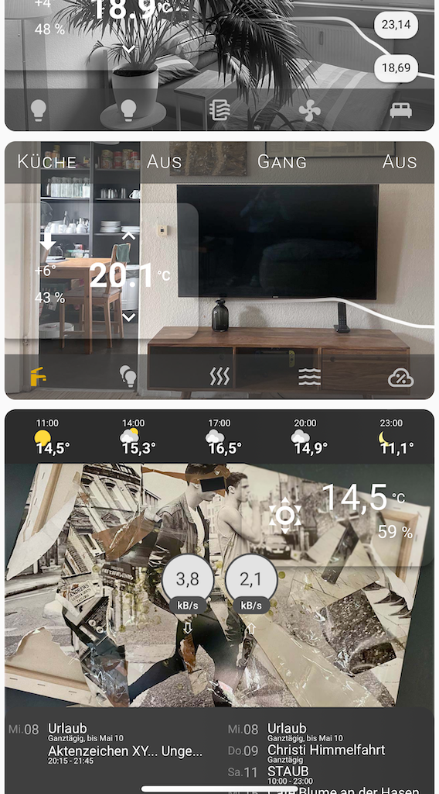
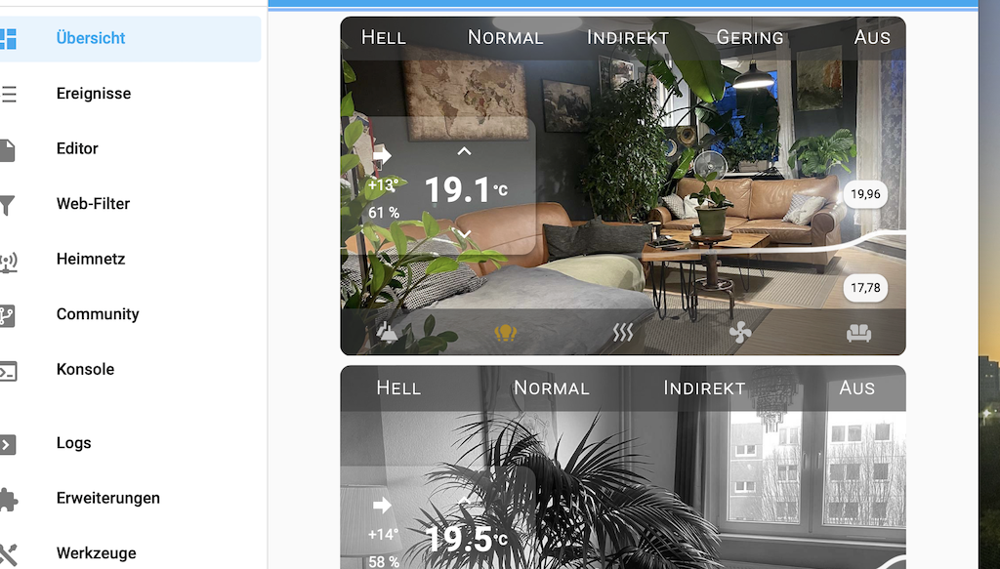
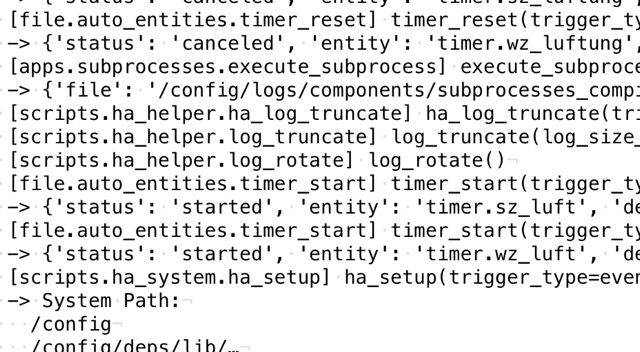

# HAConfig-as-PyCode

HAConfig-as-PyCode is an event-driven, programmatic Home Assistant configuration project leveraging Python for enhanced reusability, encapsulation, and modular expandability. This project provides an alternative automation approach, focusing on developers compared to Home Assistant's default YAML-based configuration.



## Implementation

HAConfig-as-PyCode is built on an event-driven architecture, integrating Python via PyScript and Home Assistant's built-in automation capabilities. It combines declarative data structures for desired state configuration with imperative logic to process these data structures in an event-driven manner, leveraging an MQTT broker.

### Main Home Automation

- **[`auto_control.py`](pyscript/auto_control.py)**: Manages control behavior for entities based on state triggers, utilizing the `ENTITIES_CONTROL` data structure with multi-condition handling.
- **[`auto_entities.py`](pyscript/auto_entities.py)**: Automates entity state management, including default states and timeout handling, using the `ENTITIES_AUTO` data structure with fallback mechanisms.
- **[`auto_motion.py`](pyscript/auto_motion.py)**: Implements motion sensor-based automations, mapping motion sensors to actions through the `ENTITIES_MOTION` data structure with adaptive lighting.
- **[`auto_notify.py`](pyscript/auto_notify.py)**: Manages external communication via notifications, leveraging the `DATA_DEVICES` structure from `data.py` for mobile push notifications and automation shortcuts.
- **[`auto_presence.py`](pyscript/auto_presence.py)**: Handles presence detection and actions based on weighted indicators and exclusions in the `ENTITIES_PRESENCE` data structure.



### Home Automation Capabilities

- **[`ha_helper.py`](pyscript/scripts/ha_helper.py)**: Provides comprehensive helper functions for interacting with Home Assistant resources like system logging and generic utility operations.
- **[`ha_system.py`](pyscript/scripts/ha_system.py)**: Manages system-related setup, configuration tasks, and environmental settings, handling runtime initialization and integration routines.
- **[`ha_utils.py`](pyscript/scripts/ha_utils.py)**: Includes utility functions for mobile notifications and event shortcuts, using the `DATA_DEVICES` structure for managing notification targets.
- **[`ha_off.py`](pyscript/scripts/ha_off.py)**: Implements functionality to turn off various entities.

### Services

- **[`air_control.py`](pyscript/apps/air_control.py)**: Controls air-based functionality.
- **[`scrape_housing.py`](pyscript/apps/scrape_housing.py)**: Scrapes housing offers from various Berlin housing providers, processes data, and sends notifications using the `DATA_SCRAPE_HOUSING_PROVIDERS` structure. Integrates with `auto_notify.py` for push notifications and mobile shortcuts via `ha_utils.py`.
- **[`subprocesses.py`](pyscript/scripts/subprocesses.py)**: Manages and executes scheduled subprocesses and commands from `data.py`:
  - **File Backup**: Scheduled backups of Home Assistant configuration files.
  - **Git Sync**: Automatic synchronization of the configuration to the Git repository.
  - **Compile**: Compiles project files, listing the structure and contents at specified times using `time_trigger`.

### Modules

- **[`constants.py`](pyscript/modules/constants.py)**: Centralizes configuration settings, entity definitions, expressions, mappings, and settings by importing them from sub-modules:
  - **[`config.py`](pyscript/modules/constants/config.py)**: General configuration settings and structure.
  - **[`data.py`](pyscript/modules/constants/data.py)**: Specific input data for automations.
  - **[`entities.py`](pyscript/modules/constants/entities.py)**: Default state for entities and conditions for behavior.
  - **[`expressions.py`](pyscript/modules/constants/expressions.py)**: Expressions for various automation scenarios.
  - **[`mappings.py`](pyscript/modules/constants/mappings.py)**: Naming and mappings.
  - **[`settings.py`](pyscript/modules/constants/settings.py)**: Specific configuration values for independent service logic.
- **[`gernic.py`](pyscript/modules/generic.py)**: Generic classes like various enumerations and custom exceptions for error handling.
- **[`utils.py`](pyscript/modules/utils.py)**: Central functions for project-wide logging, log rotation, expression generation, and diagnostics.

### Native Python

- **[`filesystem.py`](pyscript/python/filesystem.py)**: Handles file system operations requiring privileges beyond the PyScript sandbox.
- **[`logfile.py`](pyscript/python/logfile.py)**: Structured file logging operations with a partly singleton pattern for consistent log handling.

### Testing (WIP)

- **Unit Tests and Mocks**: The project includes a suite of unit tests and mock classes to ensure testing of different components. Tests are located in the **`tests`** directory.



## Structure

```plaintext
apps/
  air_control.py
  scrape_housing.py
auto_control.py
auto_entities.py
auto_motion.py
auto_notify.py
auto_presence.py
modules/
  constants/
    config.py
    data.py
    entities.py
    expressions.py
    mappings.py
    settings.py
  exceptions.py
  utils.py
python/
  filesystem.py
  logfile.py
requirements.txt
scripts/
  ha_helper.py
  ha_off.py
  ha_system.py
  ha_utils.py
  subprocesses.py
  tests.py
```

### Customization

- **User Interface**: The project includes various custom templates for the Home Assistant Lovelace UI. These are implemented through the **`templates/`** directory and external data integration.

    - **`badges.yaml`**: Defines badge cards for displaying system status, backup information, air quality, and providing quick access to common actions like turning everything off.
    - **`bar.yaml`**: Implements customizable button bars for room-specific lighting and device control.
    - **`calendar.yaml`**: Includes a customized calendar view for displaying upcoming events from various calendars.
    - **`card-art.yaml`**: Provides a comprehensive overview card with weather information, badges, and a calendar view.
    - **`card.yaml`**: Defines room-specific overview cards with dynamic images, thermostat controls, and button bars.
    - **`clima.yaml`**: Implements a custom thermostat card with temperature graphs and trend indicators.
    - **`weather.yaml`**: Includes a weather forecast card and a custom weather display.

- **Backup and Synchronization**: Automated backup and synchronization of the Home Assistant configuration and data.

- **External Data**: The project integrates external data from various sources through sensors defined in the **`config/.sensors/`** directory:
  
  - **Housing Offers**: Scrapes and delivers housing offers and real estate listings from various companies in Berlin. The data is delivered via notifications to trigger mobile services.

- **Customized Shell**: The project includes a customized shell environment with an optimized configuration for the Zsh shell, located in **`files/.zshrc`**.

## Project Structure

```plaintext
config/
  assistant.yaml
  calendar.yaml
  frontend.yaml
  http.yaml
  log.yaml
  pyscript.yaml
  sensors.yaml
  timer.yaml
  utils.yaml
files/
  .zshrc
  pyscript/
    [..]
```